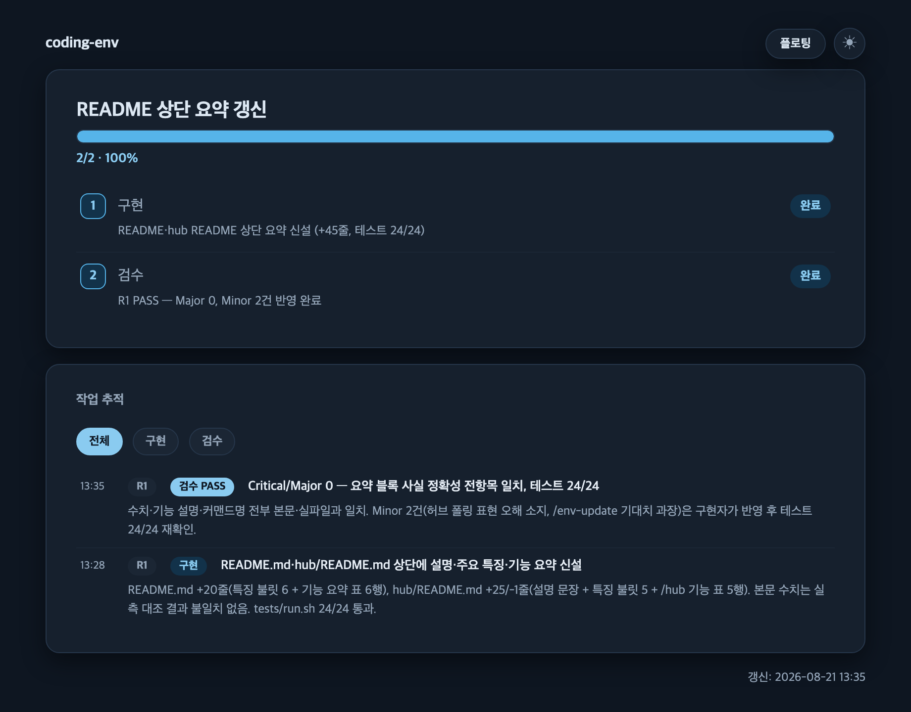

# Claude Code 개발 환경 배포

개인 Claude Code 워크플로우, 코드 품질 규칙, 에이전트 설정을 독립 git 레포로 패키징했다. 어느 프로젝트든 동일한 개발 환경을 재구성할 수 있다.

**주요 특징**

- md 문서가 곧 실행 명세다 — 커맨드·에이전트·규칙이 모두 마크다운 파일이고, Claude가 그 파일을 그대로 읽어 수행한다
- 설치는 순수 bash 스크립트 하나(`install.sh`)이며 외부 의존성이 없다
- manifest(`.coding-env.json`) 기반 자동 업데이트 — 설치 이후에는 `/env-update` 한 줄로 실행한다
- 레포가 배포한 파일만 관리하는 소유권 원칙 — 대상 디렉토리에만 있는 다른 파일은 건드리지 않는다
- 작업 규모에 따라 설계→구현→검수(전체 경로)와 구현→검수(축약 경로)로 나뉘는 개발 워크플로우를 규정한다

**기능 요약**

| 구성 | 내용 |
|------|------|
| 설치/업데이트 | `install.sh`(project/user scope, dry-run, force) · `/env-update` |
| 워크플로우 커맨드 | `prp-prd → prp-plan → prp-implement → prp-pr` 체인 + `prp-commit`·`code-review` |
| 에이전트 | `design-architect`(설계)·`implementer`(구현)·`code-reviewer`(검수)·`explore`(탐색) |
| 규칙 | JS/TS·React·웹·RN 스택 큐레이션 37개(공통 12개 항상 로드, 나머지 조건부) |
| 대시보드 | `/dashboard` — 세션 진행 상황을 프로젝트 로컬 HTML로 기록 |
| 허브 | `/hub` — 여러 프로젝트 진행 상황을 한 페이지에 집계(별도 설치) |

## 설치

### AI 에이전트로 설치 (대화형)

> **이 절은 에이전트에게 주는 지시문이다.** 사람이 셸에서 직접 설치하려면 아래 「기본 사용법」으로.
> 사용자가 이 레포 URL을 붙여넣고 "설치해줘"라고 하면 아래 순서대로 수행한다.

1. **레포 확보** — 이미 로컬에 clone 돼 있으면 그 경로를 쓴다. 없으면 **설치 대상 프로젝트
   바깥에 clone 한다**(예: `~/works/coding-env`). 대상 프로젝트 안에 clone 하면 남의 레포가
   프로젝트 트리에 그대로 남는다.
2. **계획 확인** — 대상 프로젝트 루트에서 `<repo>/install.sh --scope project --dry-run` 을 실행하고
   출력을 사용자에게 보고한다. `--scope` 는 생략할 수 없다.
3. **설치** — `--dry-run` 없이 재실행한다. exit 0 이면 4단계로.
   - **exit 1 이고 CLAUDE.md 충돌인 경우**: 대상 프로젝트에 이미 CLAUDE.md 가 있다는 뜻이다.
     **자동으로 `--force` 를 붙이지 않는다.** 배포본은 범용 지침이고 기존 파일에는 프로젝트
     고유 내용(아키텍처·병목·빌드 명령)이 들어 있어, 덮어쓰면 그 내용이 본문에서 사라진다.
     차이를 요약해 보여주고 선택을 받는다:
     (a) `--force` 로 덮어쓰기 — 기존 파일은 `CLAUDE.md.bak-<타임스탬프>` 로 자동 백업되므로,
         **덮어쓴 뒤 백업본에서 프로젝트 고유 섹션을 되살려 병합한다**.
     (b) 중단 — 사용자가 직접 병합한 뒤 다시 요청한다.
   - **exit 1 이고 rules/agents/commands 차이인 경우**: 이전에 설치한 파일이 수정됐다는 뜻이다.
     차이 파일 목록을 그대로 보여주고 `--force` 여부를 확인받는다.
4. **대시보드 옵션 질문** — 설치가 **성공한 직후, 최종 보고 전에** 묻는다. 안내는 3줄을 넘기지 않는다:
   - 전체 경로(설계→구현→검수)·축약 경로(구현→검수) 작업의 진행 상황을 `.claude/dashboard.html` 로 기록하는 기능이다.
   - 브라우저로 열어 보며, 커밋되지 않는 로컬 파일이다.
   - 지금 정하지 않아도 되고, 나중에 `/dashboard on` · `/dashboard off` 로 언제든 바꿀 수 있다.

   `AskUserQuestion` 도구가 있으면 선택지 2개(**켜기(기본)** / **끄기**)로 묻고, 없으면 평문으로
   같은 내용을 묻는다. 사용자가 답하지 않고 다른 지시로 넘어가면 **기본값(켜짐)을 유지**하고
   최종 보고에 그 사실과 전환 방법을 한 줄 남긴다.
5. **선택 반영** — `.claude/commands/dashboard.md` 의 「`on`/`off`」 절을 **읽고 그대로 수행한다.**
   (방금 설치된 슬래시 커맨드가 이번 세션에서 인식되지 않을 수 있으므로 파일을 직접 읽는다.)
   *켜기*를 골랐고 파일에 필드가 없다면 **할 일이 없다** — 기본값이 켜짐이다.
6. **최종 보고** — 반영된 파일 수, 대시보드 옵션의 최종 상태, 전환 방법(`/dashboard on|off`)을
   각 한 줄로 보고한다. 3단계에서 install.sh 가 **전역 커맨드 불일치 경고**를 냈다면, 이 머신에서는
   전역 사본이 우선하므로 `install.sh --scope user` 로 전역도 갱신하라고 함께 안내한다.

### 기본 사용법

**프로젝트 레벨 설치** (현재 프로젝트에 적용)

```bash
# 설치하려는 프로젝트 디렉토리에서 실행
cd /path/to/my-project
/path/to/coding-env/install.sh --scope project
```

**사용자 레벨 설치** (`~/.claude` 에 전역 적용)

```bash
/path/to/coding-env/install.sh --scope user
```

**계획만 확인 (파일시스템 변경 없음)**

```bash
./install.sh --scope project --dry-run
```

**기존 파일 덮어쓰기**

```bash
./install.sh --scope project --force
```

### 플래그 상세

| 플래그 | 필수 | 동작 |
|--------|------|------|
| `--scope project` | 택1 필수 | 현재 디렉토리(`$PWD`)에 설치 |
| `--scope user` | 택1 필수 | `~/.claude/` 에 설치 |
| `--force` | 아니오 | CLAUDE.md 백업 후 덮어쓰기. rules/agents/commands 차이가 있어도 덮어쓰기 |
| `--dry-run` | 아니오 | 계획만 출력. 파일시스템 변경 없음 |
| `--help` | 아니오 | 사용법 출력 후 종료 |

**중요**: `--scope` 를 생략하면 오류 발생. 잘못된 대상에 설치하는 사고를 방지하기 위해 항상 명시해야 한다.

## 설치 대상

| 항목 | 파일 수 | project 경로 | user 경로 | 로드 시점 |
|------|--------|-------------|----------|----------|
| CLAUDE.md | 1 | `./CLAUDE.md` | `~/.claude/CLAUDE.md` | **항상** |
| rules/ | 37 | `./.claude/rules/` | `~/.claude/rules/` | 12개 항상 · 25개 조건부 |
| agents/ | 4 | `./.claude/agents/` | `~/.claude/agents/` | 호출 시 |
| commands/ | 9 | `./.claude/commands/` | `~/.claude/commands/` | 호출 시 |

**합계**: project·user 모두 51개 파일.

상시 컨텍스트를 차지하는 것은 **CLAUDE.md 1개 + rules 12개 = 13개(약 34KB)** 뿐이다.
나머지는 조건이 맞을 때(rules 25개) 또는 호출할 때(agents 4개, commands 9개)만 로드된다.

### CLAUDE.md 구성

배포되는 CLAUDE.md는 **범용 개발 지침**이다. 프로젝트 고유 내용(아키텍처, 성능 병목,
빌드 명령, 팀 커밋 컨벤션)은 각 프로젝트가 자체 CLAUDE.md에 추가하며, 충돌 시 프로젝트가 우선한다.

- **개발 워크플로우** — 작업 규모로 경로를 분류: 전체 경로(설계→구현→검수) /
  축약 경로(구현→검수) / 생략(로직 없는 수정). 어느 경로든 **검수는 생략하지 않는다**
- **모델 운용 원칙** — 설계 opus / 구현 sonnet / 검수 sonnet(민감 영역은 opus 승격) / 탐색 haiku
- **코드 품질 가이드라인** — 함수 50줄·중첩 3단계 이내, 외부 I/O와 순수 로직 분리,
  YAGNI, 매직 넘버 상수화, 축약 없는 이름 등. 아래 rules와 수치 기준이 통일되어 있다

### commands 구성

`prp-prd` → `prp-plan` → `prp-implement` → `prp-pr` 워크플로우와 그 의존 대상이다.

| 커맨드 | 줄 수 | 역할 |
|--------|------|------|
| `prp-prd` | 447 | 문제 정의 우선 PRD 작성 (대화형) |
| `prp-plan` | 502 | 코드베이스 분석 기반 구현 계획 수립 |
| `prp-implement` | 385 | 계획 실행 + 검증 루프 |
| `prp-pr` | 184 | 브랜치 변경 분석 후 GitHub PR 생성 |
| `prp-commit` | 131 | 자연어로 파일 지정해 커밋 (컨벤션: 프로젝트 CLAUDE.md > commitlint 설정 > 기본 형식) |
| `code-review` | 311 | 로컬 변경 또는 PR 검수 |
| `env-update` | 319 | coding-env 레포 업데이트 (manifest 기반 자동 갱신) |
| `dashboard` | 1684 | 세션 진행 상황을 프로젝트 로컬 HTML 대시보드로 기록 (init/step/impl/log + on/off 스위치, `serve`로 플로팅) |
| `hub` | 280 | 로컬 모든 프로젝트 진행 상황을 한 페이지에 집계 (**별도 설치** — [hub/README.md](hub/README.md)) |

각 커맨드의 동작:

- **`/prp-prd`** — 대화형 질문으로 문제 정의부터 시작해 PRD 문서를 생성한다.
  결과물의 Implementation Phases 표가 `/prp-plan` 의 입력이 된다.
- **`/prp-plan`** — PRD 또는 기능 설명을 받아 코드베이스를 분석하고,
  단계별 검증 기준이 포함된 구현 계획 문서를 만든다.
- **`/prp-implement`** — 계획을 순서대로 실행하며 단계마다 테스트·lint 검증 루프를 돈다.
- **`/prp-pr`** — 브랜치의 전체 커밋을 분석해 요약과 테스트 계획이 담긴 GitHub PR을 생성한다.
- **`/prp-commit`** — "the auth changes" 같은 자연어로 커밋 대상을 지정하면
  스테이징부터 메시지 작성까지 수행한다. 메시지 형식은
  **프로젝트 CLAUDE.md 컨벤션 > commitlint 설정(`.commitlintrc*` 등) > 기본 `{type}: {description}`**
  순으로 해석한다.
- **`/code-review`** — 로컬 미커밋 변경 또는 GitHub PR을 보안(CRITICAL)부터
  베스트 프랙티스(LOW)까지 심각도별로 검수하고, CRITICAL/HIGH 발견 시 커밋·머지 차단을 권고한다.
- **`/env-update`** — 설치된 coding-env를 최신 버전으로 업데이트한다.
  manifest 파일에서 레포 경로·scope를 읽어 자동으로 pull 후 재설치한다.
  변경이 있으면 사용자 확인을 받고, 로컬 수정 충돌 시 `--force` 여부를 묻는다.
- **`/dashboard`** — 전체 경로·축약 경로 작업의 진행 상황을 프로젝트 로컬 `.claude/dashboard.html`
  하나로 기록한다. `init`은 호출될 때마다 파일을 지우고 처음부터 새로 만든다 — 이전
  작업의 진행 상태와 작업 추적 로그는 남지 않으므로 작업 착수 시 1회만 부른다. 최상단
  헤더에 프로젝트 명(디렉토리 이름)이 표시되어 여러 프로젝트의 대시보드를 동시에 열어도
  구분된다. 진행 단계는 전체 경로 기준 설계·승인·구현·검수 4단계(축약 경로는 구현·검수 2단계)이며 커밋은 단계에 포함되지 않는다 —
  검수 완료가 곧 100%다(커밋은 `log commit`으로만 별도 기록). 파일을 만든 뒤 로컬 서버를
  자동으로 띄우고 브라우저를 연다(불가능한 환경에서는 조용히 `file://` 안내로 폴백한다).
  `init`으로 생성하고 `step`(단계 상태)·`impl`(「구현」 단계 전용 세부 작업 패널)·`log`(작업
  추적)로 갱신하며, 상태는 메인 세션이 서브에이전트를 디스패치·완료 확인하는 시점에만
  반영된다(실시간 진행률은 아님).
  `on`/`off`(`dashboard_enabled`, 기본 켜짐)로 이 프로젝트·나에게만 기록 여부를 전환할 수
  있고, 자동으로 뜬 서버에서 Document Picture-in-Picture 플로팅 창을 열면 5초 간격 폴링
  갱신된다(`serve`는 서버가 없을 때 수동으로 다시 띄우는 용도로 남아 있다). 커밋 로그를
  남기면(`log commit`) 자동으로 띄웠던 서버가 정리되고, 이미 열려 있던 플로팅 창은 마지막
  화면 그대로 조용히 고정된다. 화면은 통합 허브(`/hub`)와 같은 라이트/다크 팔레트를 쓰며,
  헤더의 토글로 전환하고 시스템 선호를 따라갈 수도 있다. `prp-*` 체인과 무관한 독립
  커맨드다.

  

- **`/hub`** — 로컬 머신에서 돌고 있는 **모든** 프로젝트의 진행 상황을 한 페이지에서
  **읽기 전용**으로 본다. **coding-env 설치와 별개로 설치한다** — 실행 코드·상주 서버·
  전역 훅·프라이버시 고지·설정 전부는 [`hub/README.md`](hub/README.md) 를 참고한다.

**의존 사슬 7종 + 독립 커맨드 2종.** `prp-implement` 가 `/code-review`·`/prp-commit`·`/prp-pr` 을,
`prp-pr` 이 `/code-review`·`/prp-commit` 을 호출한다. 일부만 설치하면 사슬이 끊기므로 전부 배포한다.
배포되는 `agents/code-reviewer.md` 도 `/code-review` 를 참조한다. `dashboard`·`hub` 는 이 사슬을
호출하지도, 호출받지도 않는 독립 커맨드다.

`--scope project` 로 설치하면 전역(`~/.claude/commands/`)과 비교해 상황을 보고한다.
`--scope user` 는 설치 대상이 곧 전역이므로 비교를 생략한다.

**주의 — 커맨드 우선순위는 전역이 프로젝트를 이긴다** ([skills 문서](https://code.claude.com/docs/en/skills):
"personal overrides project"). rules·agents 와 방향이 반대다:

| 자산 | 같은 이름일 때 이기는 쪽 |
|------|------------------------|
| rules | 프로젝트 |
| agents | 프로젝트 |
| commands | **전역** |

따라서 전역에 같은 이름의 커맨드가 **다른 내용**으로 존재하면, 프로젝트 사본은 무시되고
전역 버전이 실행된다. install.sh 가 이 상황을 감지해 경고하며, 프로젝트 사본을 쓰려면
`install.sh --scope user` 로 전역을 갱신하면 된다. 전역에 커맨드가 없는 새 머신에서는
프로젝트 사본이 그대로 동작한다.

같은 이름이 양쪽에 있어도 **토큰 이중 비용은 없다** — 이긴 쪽 하나만 커맨드 목록에
등재되고(description 한 줄), 본문은 호출할 때 이긴 쪽 것만 로드된다.

### agents 구성

CLAUDE.md 「개발 워크플로우」의 3단계(설계 → 구현 → 검수)를 역할별 서브에이전트가 분담한다.

| 에이전트 | 모델 | 역할 |
|---------|------|------|
| `design-architect` | opus | **설계 전담.** 전체 경로 작업에서 구현 전에 설계 문서(PRP)를 생성. 구현 코드는 작성하지 않음 |
| `implementer` | sonnet | **구현 전담.** 승인된 PRP 기반(전체 경로) 또는 접근 방식 보고 후(축약 경로) 코드 작성. 테스트·lint·type check 전부 통과가 완료 기준 |
| `code-reviewer` | sonnet | **검수 전담.** 코드를 직접 수정하지 않고 보고만 — Edit/Write 권한이 의도적으로 없음. PASS/FAIL 판정이 커밋 게이트 |
| `explore` | haiku | **탐색·수집 전용** 저비용 에이전트. 판단이 필요한 작업(설계·구현·검수 판정)에는 사용하지 않음 |

- 작업 에이전트 3종은 `Skill` 도구를 보유해, 설치된 `/prp-plan`·`/prp-implement`·`/code-review`
  커맨드를 직접 로드해 절차대로 수행한다. 커맨드 미설치 환경에서는 각자의 내장 체크리스트로
  동작한다 (fallback).
- 모델 배분은 CLAUDE.md 「모델 운용 원칙」을 따른다: 판단 오류의 파급이 가장 큰 설계에 opus,
  토큰 소비가 가장 큰 구현에 sonnet, 수집 전용에 haiku.

### rules 구성

37개 규칙 파일은 JS/TS + React + 웹 + React Native/Expo 스택에 맞춰 큐레이션되어 있다:

| 분류 | 파일 수 | 로드 방식 | 설명 |
|------|--------|----------|------|
| common/ | 11 | **항상** | 언어 무관 원칙 (coding-style, testing, git-workflow, karpathy-guidelines 등) |
| README.md | 1 | **항상** | rules 구조·우선순위 안내 |
| typescript/ | 5 | **조건부** | `paths`(ts/tsx/js/jsx) 매칭 시 로드 |
| react/ | 5 | **조건부** | `paths`(tsx/jsx, components·hooks 디렉토리의 ts/js) 매칭 시 로드 |
| web/ | 7 | **조건부** | `paths`(tsx/jsx/vue/svelte/css/scss/sass/less/html) 매칭 시 로드 |
| react-native/ | 8 | **조건부** | React Native/Expo 확장 (accessibility·production-readiness 포함) |

**항상 로드되는 rules**: 12개, ~26KB (CLAUDE.md 포함 시 13개, ~34KB)

`common/karpathy-guidelines.md` 는 Andrej Karpathy의 관찰에서 파생된, LLM 코딩의 흔한 실패를 줄이기 위한 행동 지침이다. 4개 원칙으로 구성된다:

1. **Think Before Coding** — 전제를 명시하고, 불명확하면 추측하지 않고 질문. 여러 해석이 있으면 임의로 고르지 않고 제시
2. **Simplicity First** — 요청 범위를 넘는 기능, 추측성 추상화, 불가능한 시나리오의 에러 처리 금지
3. **Surgical Changes** — 요청과 무관한 인접 코드를 "개선"하지 않음. 모든 변경 줄이 요청으로 소급 가능해야 함
4. **Goal-Driven Execution** — 작업을 검증 가능한 목표로 변환 ("버그 수정" → "재현 테스트 작성 후 통과시키기")

`paths` frontmatter가 없으므로 **설치된 모든 프로젝트에서 자동 적용**된다. `common/coding-style.md` 의 에러 처리 정책(실제 발생 가능한 실패만 처리)도 이 지침의 #2와 정렬되어 있다.

**조건부 로드 방식**: `paths` 규칙은 Claude가 **매칭되는 파일을 실제로 Read/Edit하는 시점**에 동적으로 로드된다 ([공식 문서](https://code.claude.com/docs/en/memory) — "Path-scoped rules trigger when Claude reads files matching the pattern"). 예: `.tsx` 파일을 편집하는 순간 react/ 규칙이 붙는다. 매칭 파일을 다루지 않는 세션에서는 로드되지 않아 컨텍스트를 절약한다.

**주의 — react-native/ 와 웹 규칙의 glob 겹침**: RN 소스도 `.ts(x)`라서 react-native 규칙 역시 `**/*.ts(x)`를 사용한다(확장자로는 구분 불가). 따라서 순수 웹 프로젝트에서도 TS 파일 편집 시 RN 규칙이 함께 로드된다. 웹 전용 프로젝트라면 설치 후 `.claude/rules/react-native/` 를 삭제한다 (RN 프로젝트에서는 반대로 web/ 삭제 가능). 단, 재설치하면 누락 파일로 간주되어 자동 복원되므로 그때 다시 삭제해야 한다.

자세한 구조는 [`rules/README.md`](./rules/README.md)를 참조한다.

## 환경 업데이트

기존에 설치한 coding-env를 최신 버전으로 업데이트한다.

### 기본 사용법

설치된 프로젝트 또는 전역 디렉토리 어디에서든:

```bash
/env-update
```

### 동작

1. **Install manifest 확인**: 이전 설치 정보(레포 경로, scope) 읽기
   - project 설치: `./.claude/.coding-env.json` 우선
   - user 설치: `~/.claude/.coding-env.json` 우선
   - 둘 다 없으면: 사용자에게 레포 경로를 대화형으로 물음
2. **변경 감지**: 레포의 최신 커밋 확인 (git fetch)
3. **사용자 확인**: 새 버전 있으면 사용자 확인 후 진행
4. **Pull & 재설치**: `git pull --ff-only` 후 install.sh 재실행
5. **Manifest 갱신**: install.sh가 자동으로 manifest 재기록

### 주의

- **Manifest는 설치 시 자동 생성**: 설치 후 `.claude/.coding-env.json` 파일이 생성되며, env-update가 읽어서 동작한다.
- **기존 설치(v1.0 이전)는 manifest 없음**: env-update 기능이 추가되기 전에 설치한 경우, manifest가 없어 첫 실행 때 레포 경로를 물어본다. 경로를 입력하면 그 이후부터는 자동이다.
- **dirty 상태 경고 후 계속**: 로컬에서 파일을 수정했으면 경고만 표시 후 진행한다.
- **충돌 시 --force 확인**: install.sh 실행 중 로컬 수정 파일 충돌 발생 시, `--force` 여부를 사용자에게 확인한다.
- **여러 scope 동시 설치**: project + user 둘 다 설치한 경우, 각각의 위치에서 별도로 `/env-update` 실행해야 한다.

## 안전장치

### CLAUDE.md (프로젝트 고유 지침)

- **기존 파일 없음**: 복사 진행
- **기존 파일 있음, `--force` 없음**: **중단** (exit 1). 다른 자산도 변경 안 함
  - 출력 예: `[WARN] ./CLAUDE.md 가 이미 존재합니다 (sha256 a3f1c8…)`
  - 복구: `--force` 플래그 추가 후 재실행
- **기존 파일 있음, `--force` 있음**: 먼저 백업 후 교체
  - 백업 파일: `CLAUDE.md.bak-20260728-144500` (타임스탬프)
  - 타임스탬프 덕분에 여러 번 `--force` 실행해도 백업이 백업을 덮어쓰지 않음

**이유**: CLAUDE.md는 프로젝트별 설정(아키텍처, 병목, 빌드 명령)을 담으며, 사용자 CLAUDE.md가 스스로 "프로젝트 루트의 CLAUDE.md에 정의한다"고 규정한다. 자동 덮어쓰기는 거의 항상 사고다.

### rules/ · agents/ · commands/ (벤더링 자산)

**소유권 원칙**: 이 스크립트는 **레포가 배포하는 파일만** 관리한다. 대상 디렉토리에만 있는 파일은 손대지 않는다.

이 구분이 중요한 이유는 대상 디렉토리가 보통 우리 것이 아니기 때문이다. 예를 들어 `~/.claude/agents/` 에는 이 레포가 배포하는 4개 외에 수십 개가 공존하고, `~/.claude/commands/` 에도 배포 대상 6개 외 수십 개가 있다.

| 대상 상태 | 판정 | 동작 |
|-----------|------|------|
| 대상 디렉토리 없음 | — | 생성 후 복사 |
| 관리 파일이 대상에 없음 | 누락 | **자동 복원** (`--force` 불필요 — 파괴 위험이 없음) |
| 관리 파일 내용이 다름 | 사용자 수정 의심 | 차이 **파일명 출력**(최대 20건) 후 **중단**(exit 1). `--force` 요구 |
| 대상에만 있는 파일 | **우리 소유 아님** | 충돌로 보지 않음. 삭제하지 않음 |

설치 후에는 배포한 파일이 전부 반영됐는지 `diff -rq` 로 검증한다. 대상에만 있는 파일은 검증 대상이 아니다.

**이유**: 단일 출처는 이 레포다. 업데이트가 필요하면 레포에서 수정하고 재설치한다. 다만 대상 디렉토리 전체를 레포 소유로 간주하면 사용자의 다른 자산을 오판하거나 파괴한다.

## 멱등성

동일한 명령을 여러 번 실행해도 안전하다:

```bash
./install.sh --scope project  # 1회차
./install.sh --scope project  # 2회차 — 이미 설치된 파일을 그대로 복사. 부작용 없음
```

## 파일 구조

```
coding-env/
├── README.md                      # 이 파일
├── install.sh                     # 배포 스크립트 (순수 bash, 외부 의존 없음)
├── CLAUDE.md                      # 배포 대상 사용자 지침
├── rules/                         # 37개 규칙 (JS/TS·React·웹·RN/Expo 스택 큐레이션)
│   ├── README.md                  # rules 구조 설명
│   ├── common/                    # 언어 무관 (11개, karpathy-guidelines 포함)
│   ├── typescript/                # TS/JS 전용 (5개, 조건부 로드)
│   ├── react/                     # React 전용 (5개, 조건부 로드)
│   ├── react-native/              # React Native/Expo 전용 (8개, 조건부 로드)
│   └── web/                       # 웹 프론트엔드 전용 (7개, 조건부 로드)
├── agents/                        # 4개 에이전트
│   ├── design-architect.md
│   ├── implementer.md
│   ├── code-reviewer.md
│   └── explore.md
├── commands/                      # 9개 커맨드 (의존 사슬 7종 + 독립 커맨드 2종)
│   ├── prp-prd.md
│   ├── prp-plan.md
│   ├── prp-implement.md
│   ├── prp-pr.md
│   ├── prp-commit.md
│   ├── code-review.md
│   ├── env-update.md
│   ├── dashboard.md
│   └── hub.md
├── hub/                            # 통합 허브 — 별도 설치(hub/README.md)
├── docs/prps/
│   ├── coding-env.md              # 설계 문서 (PRP rev4)
│   └── hub-dashboard.md           # 통합 허브 대시보드 설계 문서
└── tests/
    ├── run.sh                     # 테스트 스크립트 (install.sh·문서 정합성)
    └── hub/                       # 허브 순수 로직 단위 테스트 (stdlib unittest)
```

## 설계 문서

전체 설계 원리와 리스크 분석은 [`docs/prps/coding-env.md`](./docs/prps/coding-env.md)를 참조한다.

## 요구사항

- bash 3.2 이상 (macOS 기본 `/bin/bash` 로 검증됨 — 별도 설치 불필요)
- `cp`, `mkdir`, `find`, `diff`, `date` (표준 유틸리티)
- 대상 디렉토리에 쓰기 권한

## 라이선스

사용자 개인 워크플로우 패키징이다.
